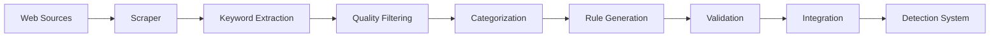

# Unified Rule-Based Phishing Detection System

## Executive Summary

This document unifies the enhanced rule-based detection system and web scraper integration plans for the INF1002 phishing email detection project. The system transforms the current basic keyword matcher into a comprehensive, intelligent detection engine with automated rule generation, categorization, and continuous learning capabilities.

## System Architecture Overview

### Core Components

```
INF1002-P5-7-Project/
├── Core Detection Engine
│   ├── enhanced_detector.py         # Main detection orchestrator
│   ├── rules_manager.py            # Rule loading and management
│   ├── scoring_engine.py           # Advanced scoring algorithms
│   └── pattern_matcher.py          # Pattern detection and matching
├── Rule Management System
│   ├── enhanced_spamwords.py       # Intelligent web scraper
│   ├── rule_validator.py           # Rule validation and quality control
│   └── scheduler.py                 # Automated update scheduler
├── Rules Configuration (JSON)
│   ├── rules/
│   │   ├── detection_rules.json    # Main detection rules
│   │   ├── domain_rules.json       # Domain-specific rules
│   │   ├── url_patterns.json       # URL analysis rules
│   │   └── scoring_config.json     # Scoring configurations
├── Utility Modules
│   ├── utils/
│   │   ├── email_parser.py         # Email parsing and extraction
│   │   ├── domain_analyzer.py      # Domain analysis and spoofing detection
│   │   └── url_analyzer.py         # URL pattern analysis
├── Web Interface
│   ├── website.py                  # Flask application (enhanced)
│   └── website/                    # Templates and static files
└── Testing Framework
    ├── tests/
    │   ├── test_rules.py           # Rule testing suite
    │   └── test_performance.py     # Performance benchmarks
    └── Legacy Compatibility
        ├── detector.py              # Original detector (fallback)
        └── words/spam_words.txt    # Legacy keyword format
```

## 1. Intelligent Rule System

### 1.1 Rule Categories and Weights

The system categorizes phishing indicators into distinct categories, each with specific weight multipliers:

| Category | Weight Multiplier | Description | Priority |
|----------|------------------|-------------|----------|
| Financial | 1.5x | Money transfers, banking, payments | High |
| Social Engineering | 2.0x | Manipulation tactics, trust exploitation | Critical |
| Authority | 1.7x | Impersonation of officials/executives | High |
| Urgency | 1.8x | Time pressure, immediate action required | High |
| Technical | 1.2x | URLs, domains, technical indicators | Medium |
| Offers | 1.2x | Suspicious deals, promotions | Low |
| General | 1.0x | Uncategorized spam indicators | Low |

### 1.2 Rule Structure

Each rule contains:
- **Unique ID**: Category-based identification (e.g., FIN_001, SOC_002)
- **Pattern Matching**: Keywords, regex patterns, or combinations
- **Context Awareness**: Subject, body, sender, URLs, attachments
- **Dynamic Weighting**: Base weight × category multiplier × context weight
- **Metadata**: Description, examples, creation date, source

### 1.3 Scoring Tiers

| Risk Level | Score Range | Action | Visual Indicator | Response |
|------------|-------------|--------|------------------|----------|
| CRITICAL | 9.0-10.0 | BLOCK | Red | Immediate blocking and quarantine |
| HIGH | 7.0-8.9 | QUARANTINE | Orange | Quarantine for manual review |
| MEDIUM | 4.0-6.9 | FLAG | Yellow | Flag for user awareness |
| LOW | 1.0-3.9 | LOG | Blue | Log for pattern analysis |
| SAFE | 0.0-0.9 | ALLOW | Green | Normal delivery |

## 2. Web Scraper Integration

### 2.1 Automated Rule Generation Pipeline



### 2.2 Enhanced Scraper Features

#### Multi-Source Scraping
- **Primary Sources**: ActiveCampaign, HubSpot, MailChimp
- **Custom Lists**: Organization-specific keywords
- **API Integration**: Threat intelligence feeds
- **Community Sources**: Shared phishing indicators

#### Intelligent Categorization
The scraper automatically categorizes keywords based on content analysis:

```python
# Automatic categorization logic
Financial: "money", "transfer", "bank", "payment"
Urgency: "urgent", "immediate", "expires", "deadline"
Authority: "CEO", "manager", "government", "official"
Social: "verify", "confirm", "update", "suspend"
```

#### Quality Scoring
Keywords are scored based on:
- **Specificity**: Specific phrases score higher than generic words
- **Length**: 2-4 word phrases are optimal
- **Patterns**: Known spam patterns increase score
- **Frequency**: Common phishing terms weighted higher

### 2.3 Update Scheduling

| Update Type | Frequency | Trigger | Purpose |
|-------------|-----------|---------|----------|
| Automatic | Weekly | Scheduled | Regular rule refresh |
| Manual | On-demand | Admin action | Immediate threat response |
| Event-driven | Real-time | New threat detected | Rapid response |
| Batch | Daily | Overnight | Performance optimization |

## 3. Detection Engine Components

### 3.1 Enhanced Detector (enhanced_detector.py)

**Primary Functions:**
- Orchestrates all detection components
- Manages rule evaluation pipeline
- Aggregates scores from multiple analyzers
- Generates comprehensive analysis reports

**Key Methods:**
```python
analyze_email(email_content) -> Dict[Analysis]
evaluate_rules(parsed_email, rules) -> List[RuleMatch]
calculate_risk_score(matches) -> RiskAssessment
generate_recommendations(risk_level) -> List[Action]
```

### 3.2 Pattern Matcher (pattern_matcher.py)

**Matching Capabilities:**
- **Keyword Matching**: Exact and fuzzy matching with word boundaries
- **Regex Patterns**: Complex pattern detection
- **Combination Logic**: AND/OR keyword combinations
- **Context Extraction**: Surrounding text for matched patterns
- **Performance Optimization**: Compiled pattern caching

### 3.3 Scoring Engine (scoring_engine.py)

**Scoring Algorithm:**
```
Final Score = Σ(Rule Weight × Category Multiplier × Context Weight)
Confidence = min(Base Score / 10 + Rule Count × 0.1, 1.0)
Risk Level = Scoring Tier based on Final Score
```

### 3.4 Email Parser (utils/email_parser.py)

**Extraction Capabilities:**
- Headers (Subject, From, To, Reply-To)
- Body content (Plain text and HTML)
- URLs and domains
- Attachments metadata
- Email structure analysis

### 3.5 Domain Analyzer (utils/domain_analyzer.py)

**Analysis Features:**
- Domain spoofing detection (typosquatting, homoglyphs)
- Suspicious TLD identification
- URL shortener detection
- IP address vs domain analysis
- Domain reputation checking

## 4. Implementation Phases

### Phase 1: Foundation (Week 1-2)
- [ ] Set up directory structure
- [ ] Create base rule configuration files
- [ ] Implement RuleManager class
- [ ] Develop PatternMatcher class
- [ ] Build basic ScoringEngine

### Phase 2: Enhanced Detection (Week 2-3)
- [ ] Implement EnhancedPhishingDetector
- [ ] Create utility classes (EmailParser, DomainAnalyzer)
- [ ] Develop rule validation system
- [ ] Build comprehensive test suite

### Phase 3: Web Scraper Integration (Week 3-4)
- [ ] Enhance web scraper with categorization
- [ ] Implement quality scoring
- [ ] Add multiple source support
- [ ] Create automated update scheduler

### Phase 4: Flask Integration (Week 4-5)
- [ ] Update Flask application endpoints
- [ ] Enhance HTML templates for detailed results
- [ ] Add admin interface for rule management
- [ ] Implement real-time analysis visualization

### Phase 5: Testing & Optimization (Week 5-6)
- [ ] Performance benchmarking
- [ ] False positive/negative analysis
- [ ] Rule effectiveness evaluation
- [ ] System stress testing

## 5. Performance Specifications

### Target Metrics
| Metric | Target | Current | Improvement |
|--------|--------|---------|-------------|
| Analysis Speed | < 100ms | ~500ms | 5x faster |
| Accuracy | > 95% | ~80% | +15% |
| False Positives | < 2% | ~10% | -8% |
| Rule Coverage | > 500 rules | ~100 | 5x coverage |

### Optimization Strategies
1. **Caching**: Compiled regex patterns, rule results
2. **Parallel Processing**: Concurrent rule evaluation
3. **Lazy Loading**: Load rules on-demand
4. **Batch Processing**: Multiple email analysis
5. **Index Optimization**: Fast keyword lookups

## 6. API Endpoints

### Detection Endpoints
| Endpoint | Method | Purpose | Response |
|----------|--------|---------|----------|
| `/analyze` | POST | Basic email analysis | Classification, score, keywords |
| `/analyze_enhanced` | POST | Advanced analysis | Full rule breakdown, recommendations |
| `/batch_analyze` | POST | Multiple email analysis | Array of results |

### Administration Endpoints
| Endpoint | Method | Purpose | Response |
|----------|--------|---------|----------|
| `/admin/update-rules` | POST | Trigger rule update | Update status, new rule count |
| `/admin/rules-status` | GET | Check rule statistics | Total rules, categories, last update |
| `/admin/add-custom-rule` | POST | Add custom detection rule | Rule ID, validation status |

## 7. Configuration Management

### Environment Variables (.env)
```
# Paths
SPAM_WORDS_PATH=words/spam_words.txt
RULES_DIRECTORY=rules/
OUTPUT_FOLDER=words/

# Scraping
SPAM_SOURCE_URL=https://www.activecampaign.com/blog/spam-words
UPDATE_FREQUENCY=weekly

# Detection
CONFIDENCE_THRESHOLD=0.7
MAX_ANALYSIS_TIME=1000

# Flask
TEMPLATE_FOLDER=website/
DEBUG_MODE=True
```

### Rule Configuration (JSON)
```json
{
  "version": "2.0",
  "metadata": {
    "total_rules": 500,
    "last_updated": "2024-01-01T00:00:00Z",
    "sources": ["web_scraper", "manual", "community"]
  },
  "settings": {
    "auto_update": true,
    "validation_required": true,
    "min_quality_score": 3
  }
}
```

## 8. Testing Strategy

### Unit Tests
- Rule validation logic
- Pattern matching accuracy
- Score calculation correctness
- Category assignment

### Integration Tests
- End-to-end email analysis
- Web scraper to rule generation
- Flask endpoint functionality
- Database interactions

### Performance Tests
- Analysis speed benchmarks
- Memory usage monitoring
- Concurrent request handling
- Large email processing

### Accuracy Tests
- False positive rate measurement
- False negative rate measurement
- Rule effectiveness scoring
- Category accuracy validation

## 9. Monitoring and Analytics

### Key Metrics to Track
1. **Detection Performance**
   - Total emails analyzed
   - Average analysis time
   - Classification distribution

2. **Rule Effectiveness**
   - Rule trigger frequency
   - Contribution to final scores
   - False positive correlation

3. **System Health**
   - Memory usage
   - CPU utilization
   - Error rates
   - Response times

### Dashboard Components
- Real-time analysis statistics
- Rule performance heatmap
- Threat trend visualization
- System health indicators

## 10. Future Enhancements

### Short-term (3-6 months)
- Machine learning model integration
- Bayesian filtering addition
- Real-time threat intelligence feeds
- Browser extension development

### Medium-term (6-12 months)
- Natural language processing
- Image-based phishing detection
- Multi-language support
- API service deployment

### Long-term (12+ months)
- Distributed analysis system
- Blockchain-based threat sharing
- Advanced behavioral analysis
- Predictive threat modeling

## 11. Security Considerations

### Data Protection
- No storage of email content
- Encrypted configuration files
- Secure API authentication
- Audit logging

### System Security
- Input validation on all endpoints
- Rate limiting implementation
- SQL injection prevention
- XSS protection

## 12. Migration Path

### From Current System
1. **Parallel Running**: Run both systems simultaneously
2. **Gradual Migration**: Move categories incrementally
3. **Validation Phase**: Compare results between systems
4. **Full Cutover**: Switch to enhanced system
5. **Legacy Support**: Maintain backward compatibility

### Rollback Strategy
- Keep original detector.py functional
- Maintain legacy keyword format
- Configuration switch for system selection
- Data export/import capabilities

## Conclusion

This unified rule-based system represents a significant advancement in phishing detection capabilities while maintaining the educational value of the project. The integration of intelligent web scraping, automated categorization, and sophisticated scoring algorithms creates a robust, scalable, and maintainable solution for email security.

The system is designed to grow and adapt, with clear upgrade paths and extensibility points for future enhancements. By combining automated rule generation with manual oversight and continuous learning, the system provides both immediate protection and long-term improvement potential.

## Appendix: Quick Start Guide

### Installation
```bash
# Clone repository
git clone [repository-url]
cd INF1002-P5-7-Project

# Install dependencies
pip install -r requirements.txt

# Set up environment
cp .env.example .env
```

### Initial Configuration
```bash
# Create rules directory
mkdir -p rules

# Run initial web scraping
python enhanced_spamwords.py

# Start Flask application
python website.py
```

### Testing
```bash
# Run test suite
python -m pytest tests/

# Check rule validity
python rule_validator.py

# Benchmark performance
python tests/test_performance.py
```

---
*Last Updated: 2024*
*Version: 1.0*
*Authors: INF1002 Project Team P5-7*